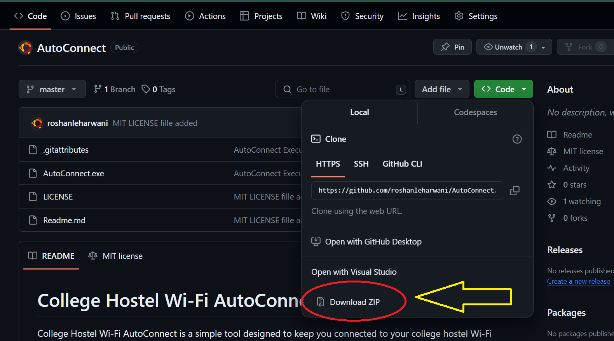

            

# VIT-AP UNIVERSITY Hostel Wi-Fi AutoConnect

VIT-AP UNIVERSITY Hostel Wi-Fi AutoConnect is a simple tool designed to keep you connected to your college hostel Wi-Fi network effortlessly. It automatically reconnects you if you get disconnected due to poor network connectivity.

## Features

- **Automatic Reconnection**: Continuously monitors your Wi-Fi connection and reconnects you if disconnected.
- **Simple Setup**: No installation required. Just run the executable file and follow the prompts.
- **Credential Storage**: Securely saves your credentials locally for future use.

## Usage

1. **Download**: You can download the latest release of the AutoConnect executable file directly from GitHub using the following command:

method 1

```bash
git clone https://github.com/roshanleharwani/AutoConnect
```

2. **Run**: Navigate to the downloaded directory and run the executable file:

   ```bash
   cd AutoConnect
   AutoConnect.exe
   ```

method 2

Download the file from code section



unzip the downloaded file and save it on your system.

3. **Recommendation**: It will be prefer that you should pin this AutoConnect.exe file to task bar or save it on your Desktop Folder for easy access.
4. **Enter Credentials**: When prompted, enter your college hostel Wi-Fi credentials (username, password, and hostel name).

5. **Save Credentials**: Your credentials will be securely saved locally for future use.

6. **Key Feature**: You can keep the file running in the background. It will automatically reconnect you if wifi disconnect due to bad condition.

## Security

Your credentials are stored securely on your local machine and are not shared with anyone. The tool does not collect any personal data or transmit information over the internet.

## Compatibility

This tool is compatible with Windows operating systems.

## Issues

If you encounter any issues or have suggestions for improvement, please open an issue on the [GitHub repository](https://github.com/roshanleharwani/AutoConnect/issues).

## License

This project is licensed under the MIT License - see the [LICENSE](LICENSE) file for details.
